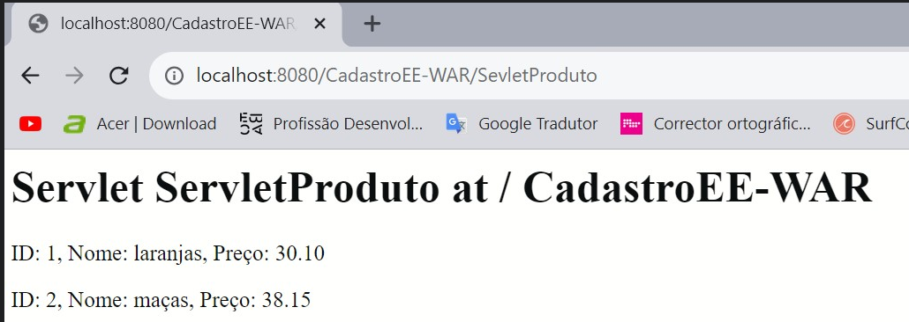
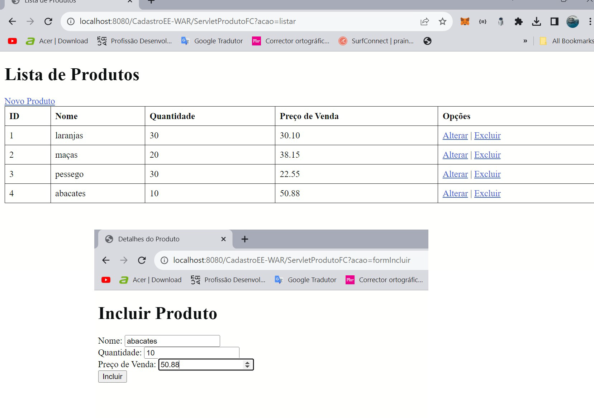
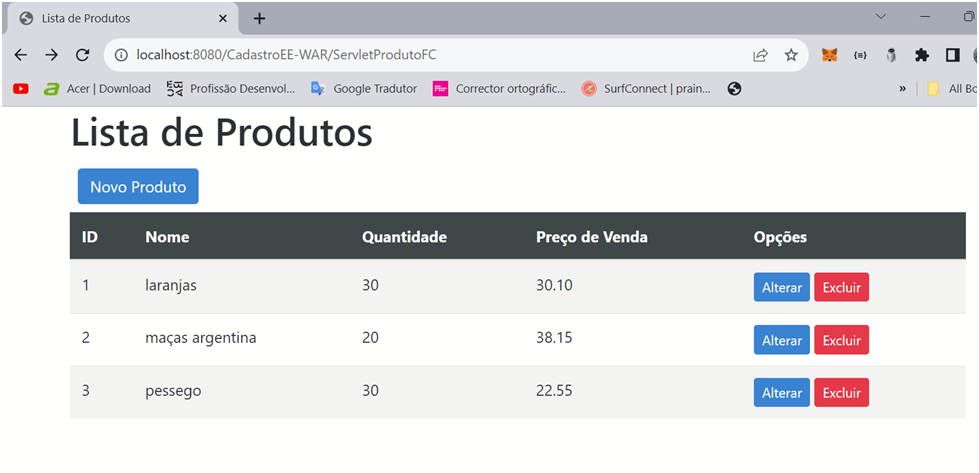
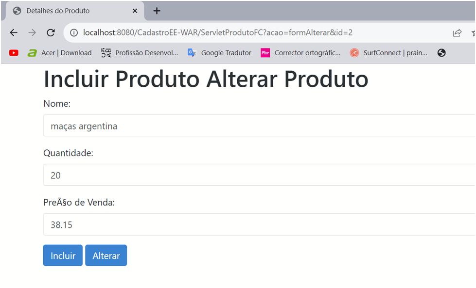
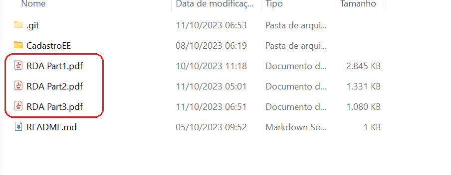
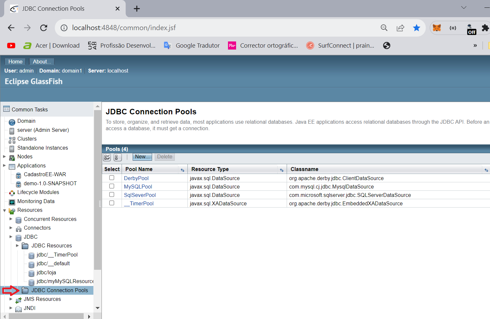

## Estacio| Missão Prática | Nível 4 | Mundo 3

## Descrição

  Conhecer como funciona uma aplicação basica JAVA WEB utilizar servlets e jsp.
  Instalar e configurar um servidor GlassFish integrando uma aplicação JAVA.
      

### Objetivos da prática

- Implementar persistência com base em JPA.
- Implementar regras de negócio na plataforma JEE, através de EJBs.
- Implementar sistema cadastral Web com   base em Servlets e JSPs.
- Utilizar a biblioteca Bootstrap para melhoria do design.
- No final do exercício, o aluno terá criado todos os elementos necessários
  para exibição e entrada de dados na plataforma Java Web, tornando-se
  capacitado para lidar com contextos reais de aplicação.
   
### Procedimentos

- Os procedimentos são divididos em duas etapas

👉 1º Procedimento | Camadas de Persistência e Controle

- Configurar do GlassFish 6.2.1 
- Configuração da conexão com SQL Server e criação no pool de conexão do glassfish
- Criar o aplicativo corporativo 
- Definir as camadas de persistência e controle no projeto
- Criar um Servlet de teste no projeto CadastroEE-war
- Executar o projeto  
- Gerar Relatório discente de acompanhamento (RDA Part1.pdf) 
      
   

 👉 2º Procedimento | Interface Cadastral com Servlet e JSPs

 - Criar um Servlet com o nome ServletProdutoFC, no projeto CadastroEE-
   war
 - Criar a página de consulta, com o nome ProdutoLista.jsp
 - Criar a página de cadastro, com o nome ProdutoDados.jsp
 - Testar as funcionalidades do sistema
 - Gerar Relatório discente de acompanhamento (RDA Part2.pdf)
    
   
  

👉 3º Procedimento | Melhorando o Design da Interface

  - Incluir as bibliotecas do framework Bootstrap nos arquivos ProdutoLista.jsp
    e ProdutoDados.jsp
  - Modificar as características de ProdutoLista.jsp

  - Modificar as características de ProdutoDados.jsp
  - Gerar Relatório discente de acompanhamento (RDA Part3.pdf) 
    

 - Os relatórios podem ser encontrados na pasta raiz

   

- Observaçoes
   - A IDE utilizada foi Intellij IDEA Ultimate
   - O jdk utilizado foi o 17
   - A execução do trabalho esta dividido em duas partes
     - parte 1
        - http://localhost:8080/cadastroEE/ListProduto

    - parte 2 e 3   
        - http://localhost:8080/cadastroEE-WAR/ServletProdutoFC 
       
- Considerações finais

  - Foi modificada a variável de contexto do Glassfish para que o mapeamento do  servlets fosse alterado de 'CadastroEE-WAR' para 'cadastroEE' por isso as imagens tem um mapeamento diferente do link de execução.

    - obs: Essa variável de contexto é configurada no momento do deploy via pagina administrativa

    - pasta arquivo '.war'
    

    - configura da variavel de contexto
    

    - conclusão do deploy
      

  - Devido a problemas na conexão entre o app e o servidor,foi necessário criar um pool de conexão para o mysql e apontar o recurso para este para poder concluir as objetivos do trabalho, porem creio que o importante é que se tenha o recurso 'jdbc/loja' apontando para um pool de conexão de qualquer banco que contenha a tabela solicitada na espec.
   
   - recurso jdbc/loja esperado 
   

   - pool de conexões disponíveis  
   

     ## Especificação oficial
    https://sway.office.com/xixE9HxcyecGGJa3?ref=Link&loc=play
    
   
